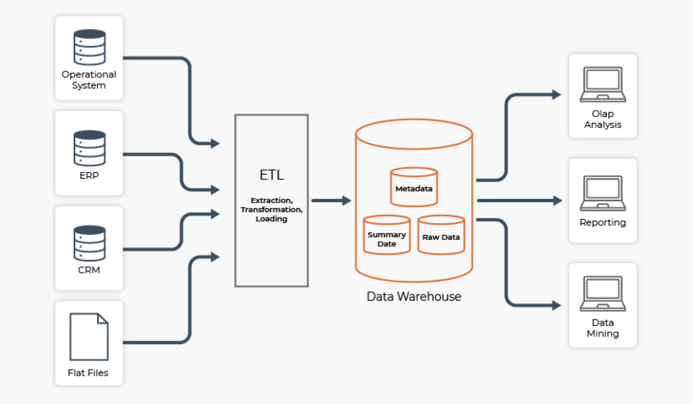
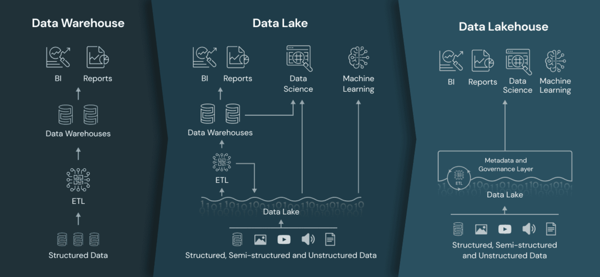

# Big Data

## Questões sobre armazenamento

1. Como armazenar grandes volumes de dados?
    - Armazenar gera custo;
    - Armazenar não é gratuito;
2. Como acessar grandes conjuntos de dados armazenados de forma eficiente?
3. Precisamos realmente armazenar tudo?
    - É preciso ter uma boa análise do negócio para armazenar apenas o que é importante;

## Banco de Dados Relacionais e NoSQL

* Banco de Dados Relacional
    - Dados Estruturados
    - Base para Data Warehouse
    - Exige a definição do schema antes do armazenamento
    Baseado em Tabelas
* Banco de Dados NoSQL
    - Dados Não Estruturados ou Semi Estruturados
    - Base para Data Lake e Data Store
    - Não exige a definição do schema antes do armazenamento
    - Baseado em Chave-Valor, Graphos, Colunas ou Documentos

## Dicas de onde armazenar

1. Os dados são estruturados ou podem ser estruturados antes do armazenamento?
    - Use um **Data Warehouse**!
2. Os dados não são estruturados ou não podem ser estruturados antes do armazenamento?
    - Use um **Data Lake** ou **Data Store**!

## Data Warehouse

Sistema de armazenamento que conecta e harmoniza grandes quantidades de dados com origem em **várias fontes diferentes**. 

Tem como objetivo o **Business Intelligence** - Relatórios e análises que oferecem suporte para a **tomada de decisões inteligentes baseadas em dados**.

Armazenam dados atuais e **históricos** e atuam como fonte única de informação confiável para uma organização.

DWs também podem ter como fonte os Data Smarts. Data Smarts são pequenas porções do DW com foco em áreas específicas da organização ou do negócio.

Como são baseados em Bancos de Dados Relacionais, seu schema precisa ser definido antes do processo de armazenamento.

DWs podem trabalhar com dados estruturados e não estruturados. Exemplo: Salvar o arquivo em um diretório e armazer o caminho do arquivo da tabela.

> Data Lakes são opções melhores para dados não estruturados.

O processo de extração e transformação dos dados antes de os armazenar no DW é conhecido como **ETL (Extração, Transformação e Carga)**.

Os dados do DW estão prontos para a análise.

## Data Lakes

Armazena o dado no seu formato **bruto**. Não realiza a limpeza e a transformmação antes de realizar o armazenamento.

> Armazena os dados em seu formato original. Da mesma maneira que está na fonte.

Tem o conceito **INVERSO** do Data Warehuose. O DW aplica o ETL antes do armazenamento. No DL o processo de Limpeza e Transformação é realizado após o armazenamento.

DWs podem trabalhar com dados estruturados e não estruturados.

Os dados do DL não estão prontos para a análise.

> Podem ser usados em conjunto com DWs formando uma grande estrutura de armazenamento chamada **Data Hub**. Exemplo: Primeiro se armazena no DL e depois extrai do DL e armazena no DW.

Como são baseados em Bancos de Dados NSQL, seu schema não precisa ser definido antes do processo de armazenamento.

É possível usar SQL em DLs.

Os dados brutos são armazenados sem a supervisão do conteúdo.

> Para que os DLs sejam eficazes é preciso o uso de técnicas e ferramentas responsáveis por **catalogar, gerir metadados, governar, controlar acesso e proteger** os dados. Sem uma gestão desses dados o Data Lake se transforma em um **Pântano de Dados (Data Swamp)**.

DLs trabalham com **ELT (Extração, Carga e Transformação)**.

> É possível, a depender do negócio, realizar uma limpeza e um tratamento prévio dos dados antes do armazenamento.

O DL é muito usado para extração de dados em **Tempo Real**.

Pode ser usado como repositório central para Engenheiros de Dados, Analistas de Negócio, Cientistas de Dados, etc.

## Data Stores

Repositório usado para armazenar de forma **persistente** coleções de dados variados como dados estruturados, documentos, chave-valor, filas de mensagens e outros.

1. Chave-Valor
    - Redis
    - Memcached
2. Texto Completo
    - Elastic Search
3. Fila de Mensagens
    - Kafka
4. Sistemas de Arquivos Distribuídos
    - Hadoop
    - AWS S3

> O Data Store se diferencia do Data Lake por ser específico para uma funcionalidade. Enquanto o DL é genérico, o DS é específico e já prepara os dados para a aplicação final.

Apresenta um custo menor que o DL e o DW.

## Sistema Híbrido de Armazenamento

> Junção de um sistema de armazenamento que usa camadas diversas de armazenamento como Data Warehouse, Data Lake e Data Store.