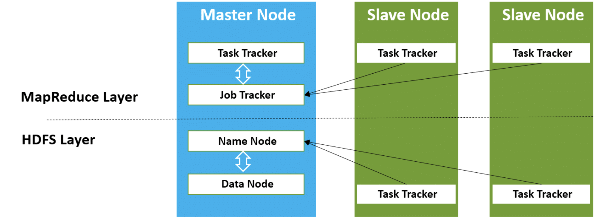

# Big Data

## Cluster de Computadores

1. Uso de várias máquinas (rede de servidores) com o mesmo propósito.
    - Usa o conceito de compartilhamento de recursos.
2. Permite a escalabilidade vertical e horizontal.
    - **Vertical**: escalabilidade individual de cada máquina do cluster.
    - **Horizontal**: escalabilidade da rede (inclusão de novas máquinas).

## Armazenamento Paralelo

Consiste em distribuir o armazenamento de dados através de diversos servidores (cluster de servidores). 

Permite aumentar de forma considerável a capacidade de armazenamento usando hardwares de baixo custo.

## Apache Hadoop

* É um **Sistema de Arquivos Distribuído**.
* Software responsável por gerenciar e permitir o armazenamento e o processamento paralelo (distribuído).
* Permite a construção de Data Lakers com hardwares de baixo custo (commodity).
* Possui dois componentes:
    - Hadoop HDFS (Armazenamento Distribuído)
    - Hadoop MapReduce (Processamento Distribuído)
* O HDFS define como os arquivos serão distribuídos e gerenciados através do cluster.
* O MapReduce divide uma tarefa em várias sub-tarefas para as executar em paralelo nas máquinas onde os dados estão armazenados.
* O MapReduce roda sobre o HDFS.

> O Apache Hadoop permitiu que o Big Data se tornasse realidade e fosse utilizado em larga escala.

* O HDFS divide as máquinas do cluster em dois tipos:
    1. **NameNode**: Máquina responsável por gerenciar o armazenamento no cluster. Informa ao JobTracker em que máquinas estão os dados necessários ao processamento.
    2. **DataNodes**: Máquinas que realizam o armazenamento propriamente dito.
* O MapReduce divide as máquinas do cluster em dois tipos:
    1. **TaskTracker**: Máquinas que realizam o processamento propriamente dito. Retornam o resultado para o JobTracker.
    2. **JobTracker**: Máquina responsável por gerenciar o processamento no cluster e agrupar os resultados dos TasksTracker.

> O Apache Spark é uma ferramenta similar ao Hadoop Map Reduce.